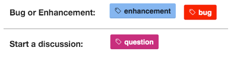
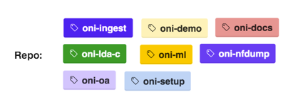
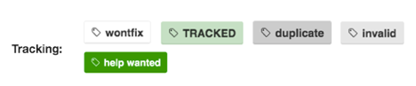
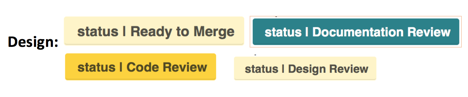

# **How to create an issue for ONI**

Please help us to improve ONI! Create your issues found following the next steps:

## **Create an Issue**

To create an issue please go to [ONI Issues](https://github.com/Open-Network-Insight/open-network-insight/issues), 
* Review current open issues for any matches.
* If there is a match, please feel free to comment on the issue.
* If you don't find a match, please continue creating your own issue.

## **Add issue type label**

* **Bug:** Something that is not working properly according the functional spec.
* **Enhancement:** Add new functionality or improve existing functionality.
* **Discussion:** Open a discussion related to any topic about ONI solution.

## **Add repo label**
Once an issue is created, add a repo tag to identify the module that needs to be tracked.
 

# **Context Labels (Added by ONI team)**  

ONI team will add a label that will be used to add context and status of the issue:

* **Wontfix:** We won't fix this issue, as part of current release or roadmap.  It  will be a nice-to-have
* **Tracked:** This issue is already part of our backlog and will be planned for future releases.
* **Duplicated:** The issue already exists.
* **Invalid:** Expected ONI functionality based in the functional spec.
* **Help wanted:** More details are required to understand the reported issue.

* **Design Review:** After a Design Spec has been submitted, this label will be applied to notify the contributor this design is under review and pending approval.
The Maintainers of ONI recommend submitting a Design Spec prior to coding feature enhancements or major changes to the code base.
* **Code Review**: This label indicates the Design has been approved and we are ready to review a PR related to your Design Spec.
* **Documentation Review**: After the code has been approved, The related documentation will need to be updated and approved.
* **Ready to Merge**: Success! this has been tested and is now ready to be merged pending LGTM from the maintainers.

