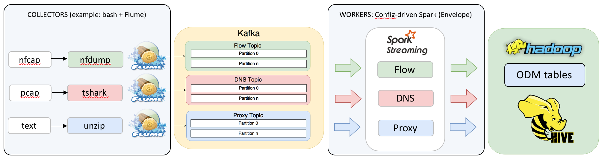

Spot Ingest Framework for the Open Data Model (ODM)
======
Spot ingest for the Open Data Model uses [Envelope](https://github.com/cloudera-labs/envelope) to enable configuration-driven Spark Streaming ingest application. 
 


## Getting Started

### Prerequisites
* [spot-setup/odm](../spot-setup/odm)
* Apache Spark 2.2 or higher
* Apache Kafka 0.10 (Cloudera Kafka 2.1) or higher
* Ingest user with sudo privileges (i.e. spot). This user will execute all the processes in the Ingest Framework also this user needs to have access to hdfs solution path (i.e. /user/spot/).

### Install
From this directory (`spot-ingest/odm`):
* Get Envelope:
```
    git clone https://github.com/cloudera-labs/envelope.git
```
* Include new Envelope features that facilitate Spot ODM ingest (NOTE: these steps will be unnecessary following the upcoming v0.6 release of Envelope):
```
    cd envelope/
    wget https://raw.githubusercontent.com/curtishoward/incubator-spot/SPOT-181_files/spot-ingest/odm/workers/envelope_mods/0001-ENV-252-Add-Hive-output-option-to-align-step-schema-.patch
    wget https://raw.githubusercontent.com/curtishoward/incubator-spot/SPOT-181_files/spot-ingest/odm/workers/envelope_mods/0001-ENV-256-Add-an-option-to-the-delimited-translator-to.patch
    wget https://raw.githubusercontent.com/curtishoward/incubator-spot/SPOT-181_files/spot-ingest/odm/workers/envelope_mods/0001-ENV-258-Fix-delimited-translator-to-handle-missing-f.patch
    patch -p1 < 0001-ENV-258-Fix-delimited-translator-to-handle-missing-f.patch
    patch -p1 < 0001-ENV-256-Add-an-option-to-the-delimited-translator-to.patch
    patch -p1 < 0001-ENV-252-Add-Hive-output-option-to-align-step-schema-.patch
```
* Build Envelope
```
    mvn clean && mvn -DskipTests package
```
### Getting Started

**Required Roles**

The following roles are required in all the nodes where the Ingest Workers will be running.
* Kafka gateway
* Spark gateway 
* Hive gateway

**Ingest Configuration**

* Create the Spot ingest Kafka topics:
```
    kafka-topics --zookeeper zookeeper-host:2181  --create --topic spot_dns   --replication-factor 3 --partitions 4
    kafka-topics --zookeeper zookeeper-host:2181  --create --topic spot_flow  --replication-factor 3 --partitions 4
    kafka-topics --zookeeper zookeeper-host:2181  --create --topic spot_proxy --replication-factor 3 --partitions 4
```
* Update Kafka `broker` and `topic` parameters in the `workers/spot_*.conf` Envelope configuration files

**Starting the Ingest**

Start the Spark Streaming application defined by the Envelope configuration (Spark driver logs will be in the working directory):
```
    bash start_ingest.sh [dns|flow|proxy]
```

**Collector Examples**

While the collector can be any application that is a Kafka producer for the source topic, examples are prodived which make use of nfdump, tshark and unzip for flow, DNS and proxy data (respectively), to dissect and then forward records to the relevant Kafka topics using Flume.

The following are required on all (Edge) nodes where the collector examples will be running:
* [Flume gateway](https://flume.apache.org/download.html)
* [Kafka gateway](https://kafka.apache.org/downloads)
* [tshark](https://www.wireshark.org/download.html) (see also [how to install](https://github.com/Open-Network-Insight/open-network-insight/wiki/Install%20Ingest%20Prerequisites) ) _or_ [spot-nfdump](https://github.com/Open-Network-Insight/spot-nfdump)

To run the collector example (from the `spot-ingest/collectors` directory):
* Update the Kafka `brokerList` parameter in each `spot_flume_*.conf` Flume configuration file
* Start the following script, which: 1) starts the Flume agent, 2) listens for and dissects new batch files for each source under the `<source_type>/new` directory:
```
   bash process_files.sh [dns|flow|proxy]
```
* Move a new dns.pcap, flow.nfcap, or proxy.log file to the receiving directory.  See [SPOT-135](https://issues.apache.org/jira/browse/SPOT-135) for sample data.  For example, if `process_files.sh` has been started for DNS:
```
    mv sample.pcap dns/new
```
* Once the file has been dissected, you should begin to see records in the `spot.event` Hive table
