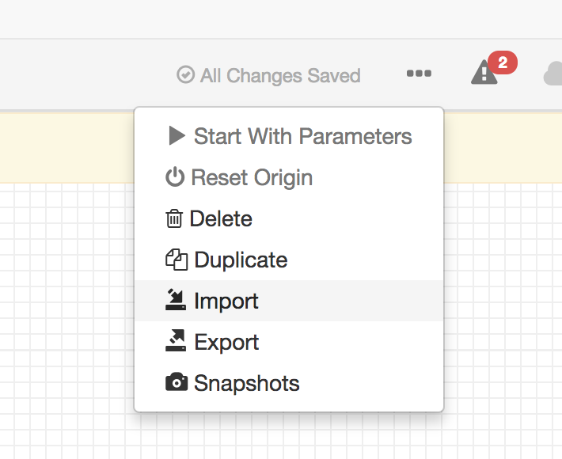
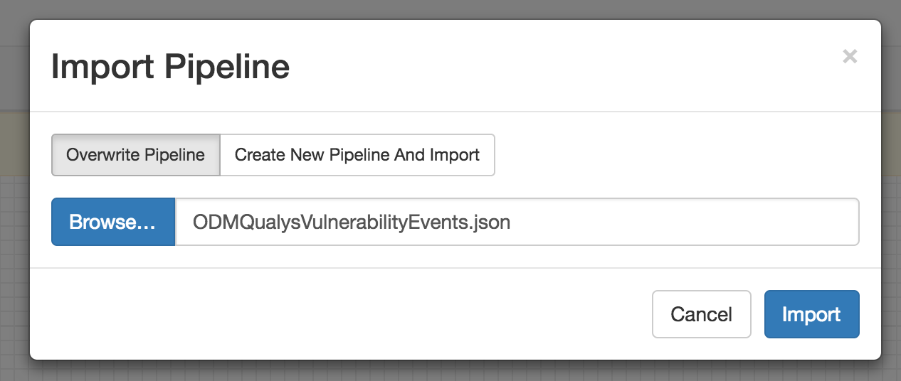

# StreamSets Ingest Pipelines for Apache Spot ODM

The [StreamSets Data Collector](https://github.com/streamsets/datacollector) is an Apache 2.0-licensed open-source tool for data ingestion pipeline development and execution.

### What's Here?
The subdirectories contain JSON pipeline configurations that can be imported into the StreamSets Data Collector, and configured to continuously ingest data into Avro-stored ODM Hive tables.

As of 9/22/2017, the following data sources are supported:
  - Qualys Knowledge Base
  - Qualys Vulernability Scans
  - Windows Security Logs
  - Centrify Identity Platform Logs

### Requirements
  - SDC 2.7.1.1 or newer: Pipelines have been built on SDC 2.7.1.1, and will work with any newer SDC version. For older SDC versions, pipelines may not import smoothly and may require re-development. A full install of SDC is recommended, as the core tarball installation does not include all required stage libraries.
  - Oracle Java 8

### Importing Pipelines
StreamSets pipeline configurations can be imported into an SDC via the REST API, CLI, or through the UI. After downloading the pipeline configurations, import the JSON files:

### License
Apache Software License 2.0

